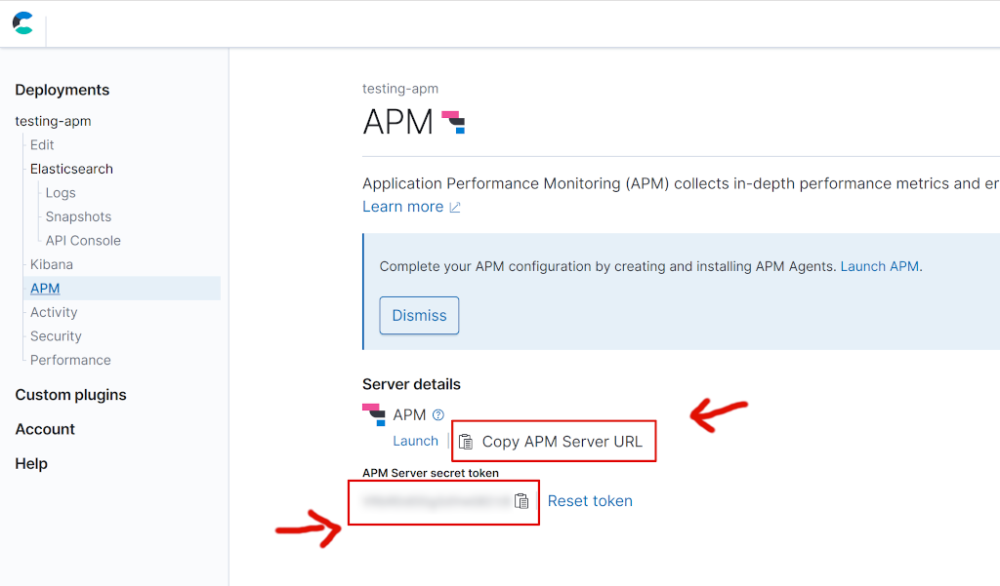

# PHP agent for Elastic APM Server

The official PHP agent for [Elastic APM](https://www.elastic.co/products/apm).
This agent is a PHP extension that must be installed in your PHP environment.

## Usage

You need to compile and install this library as PHP extension.
At the moment, this extension is only available for Unix like OS.
To install the extension you need to execute the command as follows:

```bash
cd src/ext
phpize
./configure --enable-elasticapm
make clean
make
sudo make install
```

You need to enable the extension in your `php.ini`. You need to add the following
line to `php.ini`:

```
extension=elasticapm.so
```

## Configure

You can configure the Elastic APM agent using the following ini settings for PHP:

```ini
elasticapm.enable = 0
elasticapm.host=http://localhost:8200
elasticapm.service_name=
elasticapm.log=
```

By default, the extension is disabled. You need to enable it setting `elasticapm.enable=1`.
You need to set a `service_name` and the default APM server host is `localhost:8200`.
If you want to log the errors generated by the agent using the `elasticapm.log`
settings. Here you can specify the path of the file that you want to use for
logging.

You can see an example of php.ini [here](src/ext/php.ini).

If you want you can also change the ElaticAPM agent at runtime, using the
following PHP code:

```php
ini_set('elasticapm.enable', '1');
ini_set('elasticapm.host', 'insert the APM Server host here');
ini_set('elasticapm.service_name', 'test');
ini_set('elasticapm.log', '/tmp/elasticapm.log');
```

## Configure with Elastic Cloud

You can also configure the PHP agent to send data to an [Elastic Cloud](https://www.elastic.co/cloud/)
APM instance. You just need to configure the `elasticapm.host` and `elasticapm.secret_token`.

The `host` and `secret_token` are available in the APM section of Elastic Cloud
(see the image below):



You can set the host and the secret token using the following PHP code:

```php
ini_set('elasticapm.host', 'insert here the host URL');
ini_set('elasticapm.secret_token', 'insert here you token');
```

or using the `php.ini` settings:

```ini
elasticapm.host=insert here the host URL
elasticapm.secret_token=insert here you token
```

## Note

**This project is still in development. Please do not use in a production environment!**

## Authors

- [Enrico Zimuel](https://www.zimuel.it)
- [Philip Krauss](https://github.com/philkra)

## Copyright

Copyright 2019 Elasticsearch BV.
Licensed under the [Apache License, Version 2.0](LICENSE).
